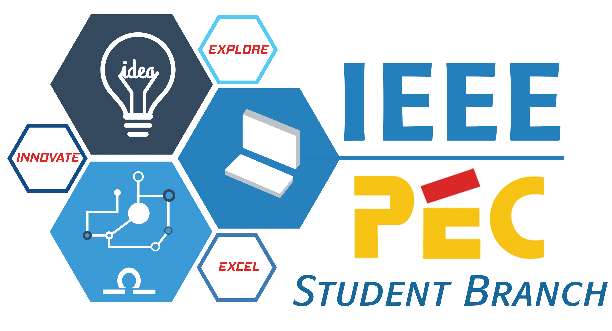

# IEEE PEC Student Branch

 

 

The Institute of Electrical and Electronics Engineers (IEEE) is a professional association dedicated to advancing technological innovation and excellence. It has about 425,000 members in about 160 countries.

The Student Chapter of IEEE in PEC was started in 2001 by Dr. Gurnam Singh. With 100+ active members, IEEE-PEC has been the strongest technical society not only in institute but entire region, for years it has served as a platform, with objective of spreading knowledge for enhancement of computer science, electrical and electronics engineers. Be it regular interactions, workshops, events or competitions, IEEE PEC has done it all. Guest lectures have been an old tradition and we have hosted Dr. Ravi Sehgal (MD, General Electric), Er. Ashish Jain (DGM, ONGC), just to name a few.

IEEE has been essential to the global technical community and to technical professionals everywhere, and has been universally recognized for the contributions of technology and of technical professionals in improving global conditions.

To provide quality and competitive environment we have collaborated with various IIT’s to host workshops and online platforms like Hackerearth for different competitions. Activities organized by IEEE PEC are central hub for technical action during our institutes, annual Technical-Cultural fest,PECFEST. Events ranging from PEC Hackathons for developers and coders to Design your Web, Electrica, Electronica and Light it up for electrical and electronic geeks, see great participation. 

Our vision to conquer zenith, zeal to learn, and the cooperation among the members has been constantly driving us forward and encouraging the budding minds at PEC to innovate for better good of society and excel in all fields.

 

[IEEE PEC Website](http://ieeepec.herokuapp.com/) | 
[IEEE PEC Application](https://play.google.com/store/apps/details?id=com.masky.ieeepecstudentdeadline) 

 

  
  &nbsp;
  &nbsp;
  
  &nbsp;
  &nbsp;
  
  &nbsp;
  &nbsp;
  

